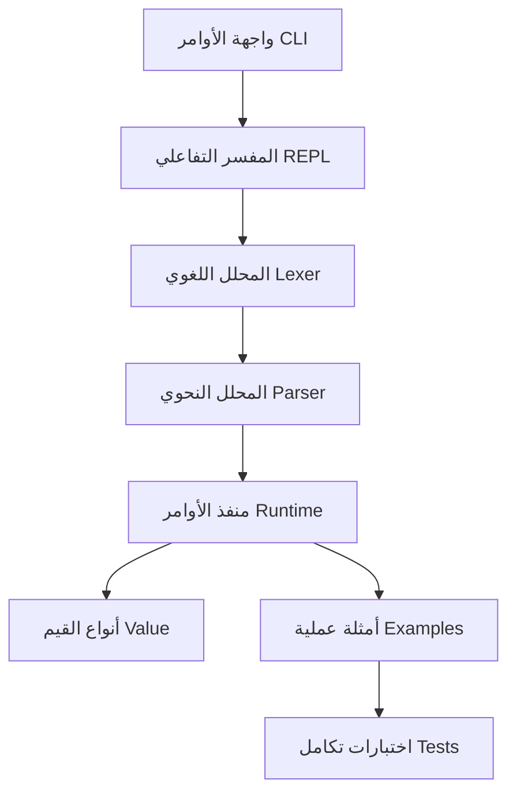

# iqra Programming Language | لغة اقرأ

## Architecture Diagram | رسم توضيحي للهيكل البرمجي



## Try Online Playground | جرب اللغة مباشرة

> **ملاحظة:** قريباً سيتم توفير محرر ويب تفاعلي لتجربة لغة اقرأ مباشرة من المتصفح.
> [رابط تجريبي (قيد التطوير)](https://iqra-playground.example.com)

- الإبلاغ عن الأخطاء: [Issues](https://github.com/AmjadAlbaaj/iqra/issues)
- دليل المساهمة: [CONTRIBUTING.md](CONTRIBUTING.md)
- مسابقات برمجية قادمة!

---

## Refactoring Notes | ملاحظات إعادة الهيكلة الأخيرة

## أفضل الممارسات البرمجية

- `to_number()` لتحويل القيم إلى رقم مع رسالة خطأ ثنائية اللغة عند الفشل.

- جميع رسائل الأخطاء في التنفيذ والتحليل والتوليد تظهر بشكل احترافي، وتساعد المطور على تصحيح الكود بسرعة.
- أمثلة الأخطاء:

```text
[تحويل إلى رقم] لا يمكن تحويل النوع 'سلسلة' إلى رقم | Cannot convert type 'string' to number.

---

<!-- NOTE: Only English anchors are used in Table of Contents for markdown lint compliance. -->
 - [Installation Guide](#installation-guide)
 - [Arabic Examples](#arabic-examples)
 - [English Examples](#english-examples)
 - [Project Structure](#project-structure)
 - [Keywords and Built-ins](#keywords-and-built-ins)
 - [Architecture Diagram](#architecture-diagram)
 - [Contributing & Community](#contributing--community)

\n## Project Introduction | مقدمة المشروع
\n## Project Introduction
اقرأ: لغة برمجة عربية أولاً، تدعم العربية والإنجليزية بالكامل، مع هيكل احترافي في Rust.
جميع الميزات والدوال متاحة بالاسم العربي والإنجليزي، مع أولوية للوضوح العربي في التوثيق ورسائل الخطأ.

---
\n## Installation Guide | دليل التثبيت والتشغيل
<a name="installation-guide"></a>
\n## Installation Guide


- زر الموقع الرسمي: [https://rustup.rs](https://rustup.rs)

- على ويندوز:

winget install Rustlang.Rustup
```

```bash
curl --proto '=https' --tlsv1.2 -sSf https://sh.rustup.rs | sh
```
```powershell
```

---
\n## Arabic Examples | أمثلة عربية
\n## Arabic Examples

```iqra
x = x + 1
```

---
\n## Advanced Features | الميزات المتقدمة
\n- أمثلة عملية ثنائية اللغة


flowchart TD
| list              | قائمة          |
| read_file         | اقرأ_ملف       |
| env_var           | متغير_بيئة     |


### مثال عربي

اطبع(١ + "نص")

اقتراح: تأكد أن الطرفين أرقام أو نصوص | Suggestion: تأكد أن الطرفين أرقام أو نصوص
```

```iqra
print(1 / 0)
```
[قسمة على صفر] القسمة على صفر | Division by zero
اقتراح: تأكد أن المقسوم عليه ليس صفراً | Suggestion: تأكد أن المقسوم عليه ليس صفراً
```

---
## iqra-pkg Package Manager | مدير الحزم اقرأ

مدير الحزم الاحترافي `iqra-pkg` يتيح لك:
- تثبيت مكتبات اقرأ بسهولة
- تحديث جميع المكتبات
## أوامر الاستخدام | Usage Commands
```bash
# تثبيت مكتبة
iqra-pkg install PACKAGE
# تحديث جميع المكتبات
iqra-pkg update
# نشر مكتبتك
iqra-pkg publish PACKAGE
# إزالة مكتبة
iqra-pkg remove PACKAGE
# البحث عن مكتبة
iqra-pkg search QUERY
# عرض المساعدة
iqra-pkg help
```

- نشر مكتبتك ليستخدمها الجميع
- تحديث المكتبات من السجل
- إزالة مكتبة من السجل (للمالك فقط)
# نشر مكتبتك إلى السجل
iqra-pkg publish <package>
# إزالة مكتبة من السجل
iqra-pkg remove <package>
```bash
# بحث عن مكتبة
iqra-pkg search قائمة
# تثبيت مكتبة
iqra-pkg install قائمة
# نشر مكتبة جديدة
iqra-pkg publish قائمتي
iqra-pkg remove قائمة
### ملاحظات هامة | Important Notes
- يتطلب النشر والإزالة تسجيل الدخول (سيتم دعم التوثيق قريباً)
## Registry API Spec (English)
Iqra registry is a RESTful API for publishing, searching, installing, updating, and removing packages. See [iqra-pkg-spec.md](pkg/iqra-pkg-spec.md) for full details.

**Endpoints:**
- `GET /packages/<name>`: Get package details
- `GET /packages/<name>/<version>/download`: Download package
- `DELETE /packages/<name>/<version>`: Remove package (auth required)
**Metadata Example:**
```json
{
    "name": "قائمة",
    "name_en": "list",
    "author": "AmjadAlbaaj",
    "description": "دالة لإنشاء قائمة في اقرأ",
    "description_en": "Function to create a list in iqra",
    "tags": ["قائمة", "list", "data-structure"],
    "lang": "ar",
    "readme": "...",
    "manifest": { ... },
    "published_at": "2025-09-13T12:00:00Z"
}
```

---
لمزيد من التفاصيل حول سجل الحزم، راجع ملف [pkg/README.md](pkg/README.md) و [iqra-pkg-spec.md](pkg/iqra-pkg-spec.md).

---
## VSCode Extension | إضافة VSCode الاحترافية

إضافة `Iqra Language Support` لبيئة Visual Studio Code:
- تمييز صيغة النص (Syntax Highlighting) للكود العربي والإنجليزي
- إكمال تلقائي للكلمات المفتاحية
- تشخيص أخطاء فوري (علامات اقتباس غير مغلقة، كلمات غير معروفة)
- تنفيذ مباشر للملفات من المحرر (أمر: Run Iqra File)
- تعليمات ذكية للكود العربي

## طريقة التثبيت | Installation
1. افتح مجلد `vscode-iqra` في VSCode
2. شغل الأمر `F5` لتجربة الإضافة في بيئة التطوير
3. أو قم بتعبئة ونشر الإضافة عبر Marketplace

## تنفيذ ملف اقرأ مباشرة | Run Iqra File
- من قائمة الأوامر: `Run Iqra File | نفذ ملف اقرأ`
- يظهر الناتج في الطرفية (Terminal)

---
## Web Playground | محرر الويب التفاعلي

> **قريباً:** يمكنك تجربة لغة اقرأ مباشرة من المتصفح عبر محرر ويب تفاعلي:
> [Iqra Playground (قيد التطوير)](https://iqra-playground.example.com)

---

